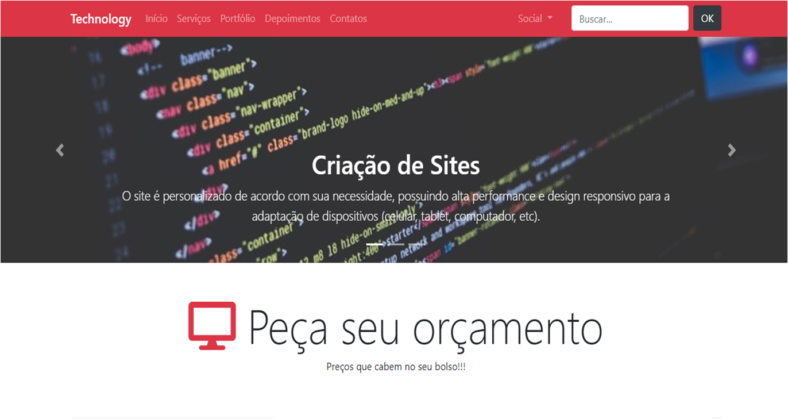

<a align="center" href="https://jacksonlacerda.github.io/bootstrap/">
  Link do Projeto
</a>

 

  

## Tecnologias

Esse projeto foi desenvolvido com as seguintes tecnologias:

- [Jquery](https://jquery.com/)
- [Bootstrap](https://getbootstrap.com/)
- [HTML](https://www.w3.org/)
- [CSS](https://www.w3.org/)

## Projeto

Este projeto é um site institucional de uma empresa TI prestadora de serviços que cria aplicativos, sites e automatiza tarefas para os seus clientes.

## Commit Semânticos

feat: Adições ao código ou novas funcionalidades.
refactor: Edições do código que não alterem sua funcionalidade.
fix: Correção de bugs.
style: Alteração em estilos.
test: Criação de testes da sua aplicação.
build: Modificação em arquivos de build.

